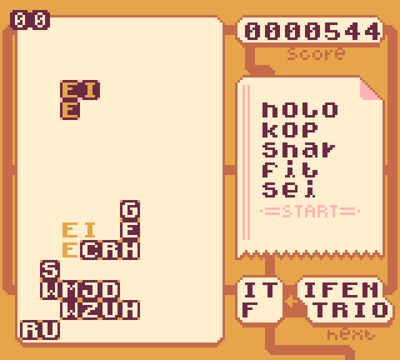

## About
**WORD BLOCKS** is a block-word-puzzle game made for the original GameBoy (but with support for the GameBoy Color!) Find the GB ROM as well as an HTML5 version hosted on [itch.io](https://ovidios.itch.io/word-blocks)!

It was made using [GBDK 2020](https://github.com/gbdk-2020/gbdk-2020), a framework for writing GameBoy games in C.

## Misc. Tools and Scripts
The game uses the Scrabble Dictionary. This repository includes a script (`create_dict/create_full_dict.py`) to create a number of C files (`dict/dict_0.c`, etc.) containing the tree structure used to quickly check if a word is contained in the dictionary.

I also built a very simple HTML app to create color palettes, which can be found under `colorpicker/index.html`.

## Screenshots

